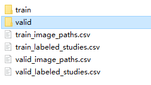
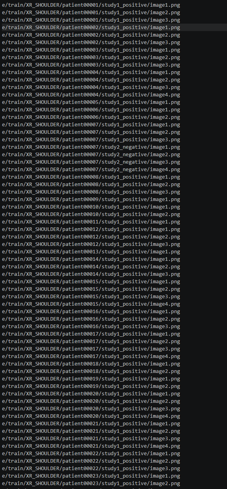
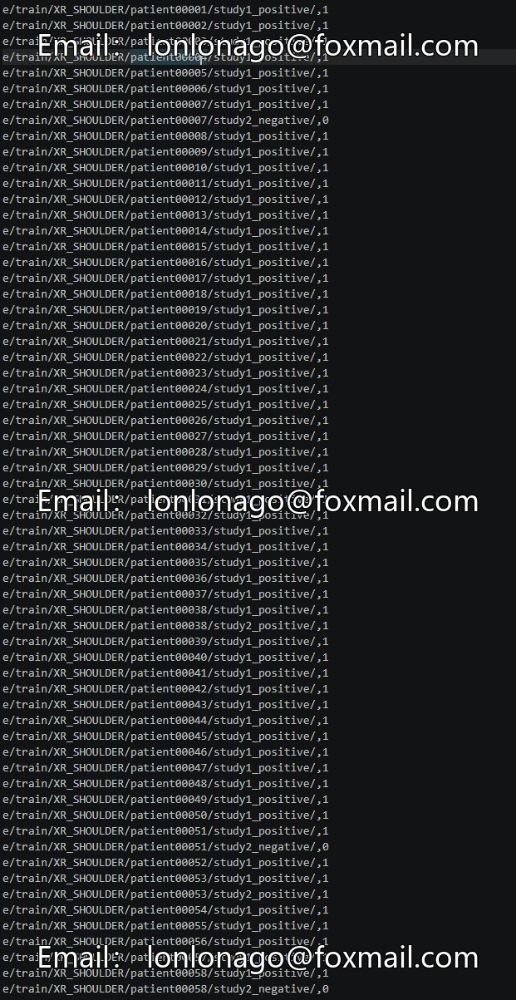
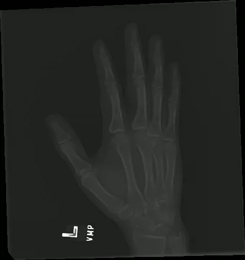

## Body

Massive Upper Limb Bone (Finger, Palm, Wrist, etc.) X-ray Two-Classification Dataset

The largest publicly available dataset for the detection of abnormalities in bone images (normal / abnormal) is released by the Stanford ML Group, currently the most commonly used dataset for this purpose.

Dataset Core Information:
----Data Releaser: Stanford ML Group (Stanford Machine Learning Group)
----Total Studies: 14,863 cases
----Total Images: 40,561 (single study contains 1 to multiple views)
----Patients: 12,173 people
----Annotations: labeled by licensed radiology physicians from Stanford Hospital (normal / abnormal)

Data Range:
----All upper limbs, excluding hips, knees, and spine:
--------Elbow (Elbow)
--------Finger (Finger)
--------Forearm (Forearm)
--------Hand (Hand)
--------Humerus (Humerus)
--------Shoulder (Shoulder)
--------Wrist (Wrist)

Folder Format:
├── train/
├── valid/
├── train_image_paths.csv - Lists all image file paths for the training set, one per X-ray image
├── train_labeled_studies.csv - Lists the abnormal labels for each case (study) in the training set, with label 1=abnormal / 0=normal
├── valid_image_paths.csv - Lists the image path for the validation set
└── valid_labeled_studies.csv - Lists the label for each case in the validation set

Electronic Virtual Products are Not Returnable

Note: This product is sold as a digital download and cannot be returned or exchanged.

## Images

item_1046284220508

Here is a pay link on Stripe ( https://buy.stripe.com/3cs8yP7sY87d0vu9AB ). Please contact me lonlonago@foxmail.com after funding $89, and I will send you a complete data files , thank you!

